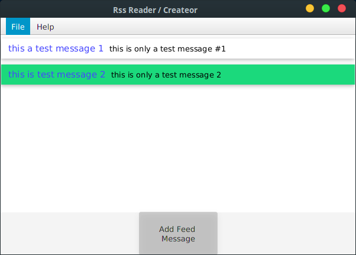
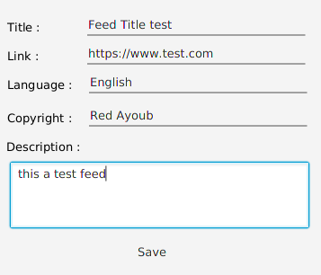
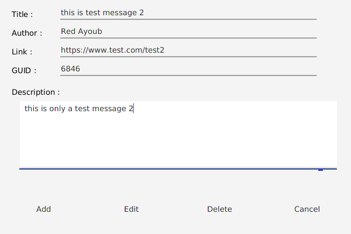

# RSS Feed Creator & Reader
A JavaFX app that alow users to read and create RSS feed

## What I Learned
- Parse XML & Create XML Files
- Retrieve input from url
- Read and create RSS Feed

## Screenshots 

## To run
1. Download the release file  
2. Make sure you have oracle jre v 8 or higher
3. type in command line or terminal ` java -jar <filename>.jar `

